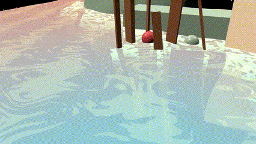

<!--
**softcat477/softcat477** is a ✨ _special_ ✨ repository because its `README.md` (this file) appears on your GitHub profile.

Here are some ideas to get you started:

- 🔭 I’m currently working on ...
- 🌱 I’m currently learning ...
- 👯 I’m looking to collaborate on ...
- 🤔 I’m looking for help with ...
- 💬 Ask me about ...
- 📫 How to reach me: ...
- 😄 Pronouns: ...
- ⚡ Fun fact: ...
-->

- 🎮Games / 🤖Interactive Stuff
  - [Ico Jam 2023](https://github.com/softcat477/Ico-2023)
  - [MaruMaru](https://github.com/softcat477/Balls)
  - [Backyard](https://github.com/softcat477/Backyard)
- 🌸Shaders and Visual Effects
  - [Dissolve](https://github.com/softcat477/Dissolve)
  - [Water Surface and Buoyancy](https://github.com/softcat477/Water-Surface-Shader)
  - [Noise Library](https://github.com/softcat477/ShaderGallery)
- 👨🏼‍💻Good Git Manner / 🪄Github Magic / 👾Automation Tricks:
  - [MuseScore](https://github.com/musescore/MuseScore/pulls/softcat477)
  - [MaruMaru](https://github.com/softcat477/Balls)
  - [Gamera](https://github.com/DDMAL/gamera4-rodan)
  - [Rodan](https://github.com/DDMAL/Rodan)
- 🛠Animation Tools
  - [SMPL to FBX (with blender addon!)](https://github.com/softcat477/SMPL-to-FBX)
- 🕍Medieval Music
  - [Rodan](https://github.com/DDMAL/Rodan)
- 🎶Tools to Make Music
  - [MuseScore](https://github.com/musescore/MuseScore/pulls/softcat477)
- 🐳Docker
  - [Rodan](https://github.com/DDMAL/Rodan)
  - [Gamera](https://github.com/DDMAL/gamera4-rodan)
  - [Docker Action](https://github.com/softcat477/hello-world-docker-action)
  - [Tutorial: Docker Compose](https://github.com/softcat477/Simple-Docker-Compose)
- ✒️Gallery:
  - 
  - 
  - 

